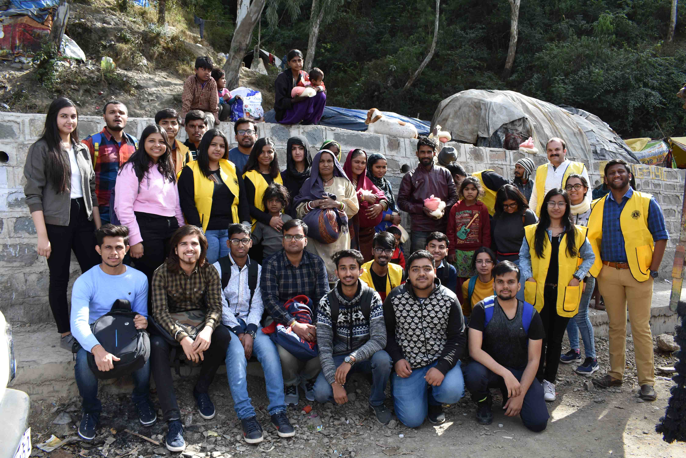
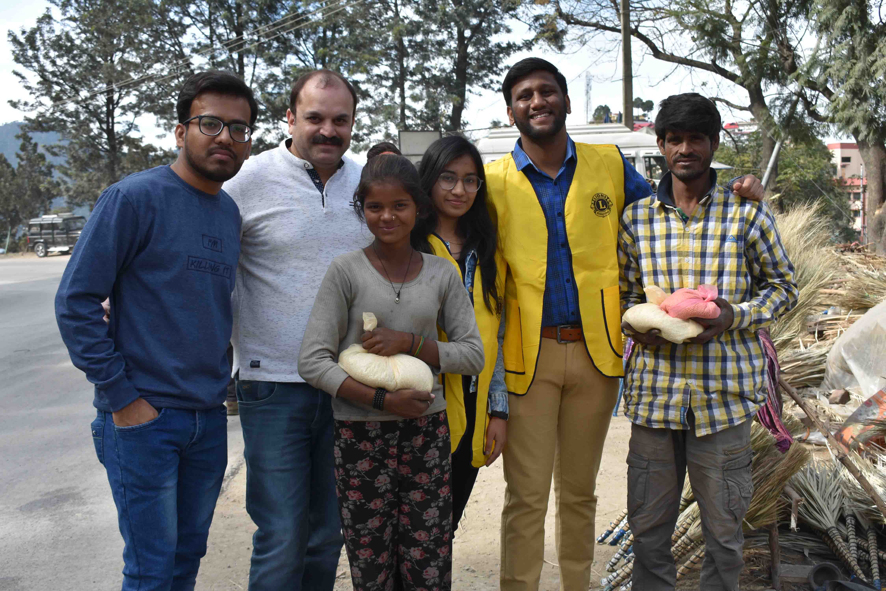

"Every child is a different kind of flower and all together they make this world beautiful place to live."

Keeping this thing in mind every year our club sets a event to visit balashram which is situated in Solan Himachal Pradesh where kids from various corners of the states come to grab knowledge at very less cost. Our main Moto to visit them is to enlighten there life with some moments of happiness so that they don't feel that they are not a part of society as they usually don't get much opportunity to explore the outer world.

[row]
[col]

[/col]
[col]

[/col]
[/row]

[row]
[col]

[/col]
[/row]

[row]
[col]

[/col]
[col]

[/col]
[/row]

[row]
[col]

[/col]
[col]

[/col]
[/row]