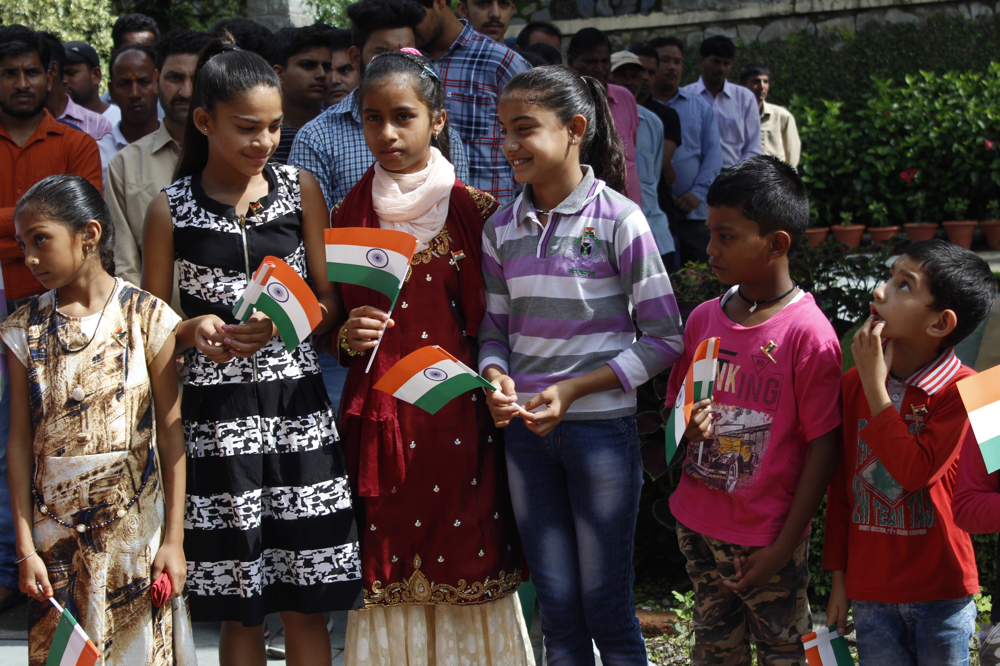
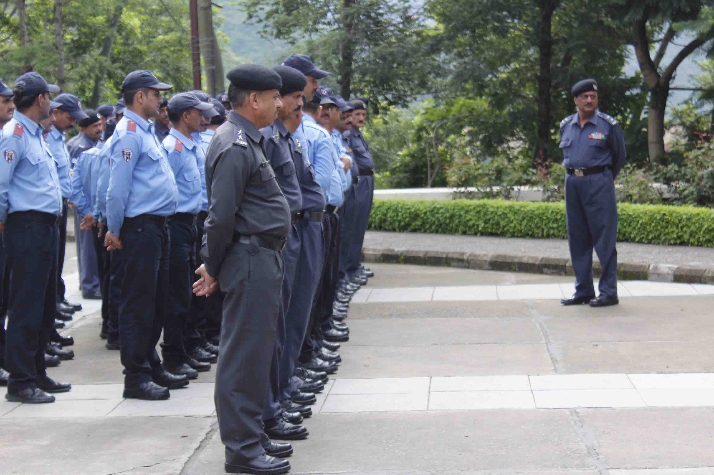
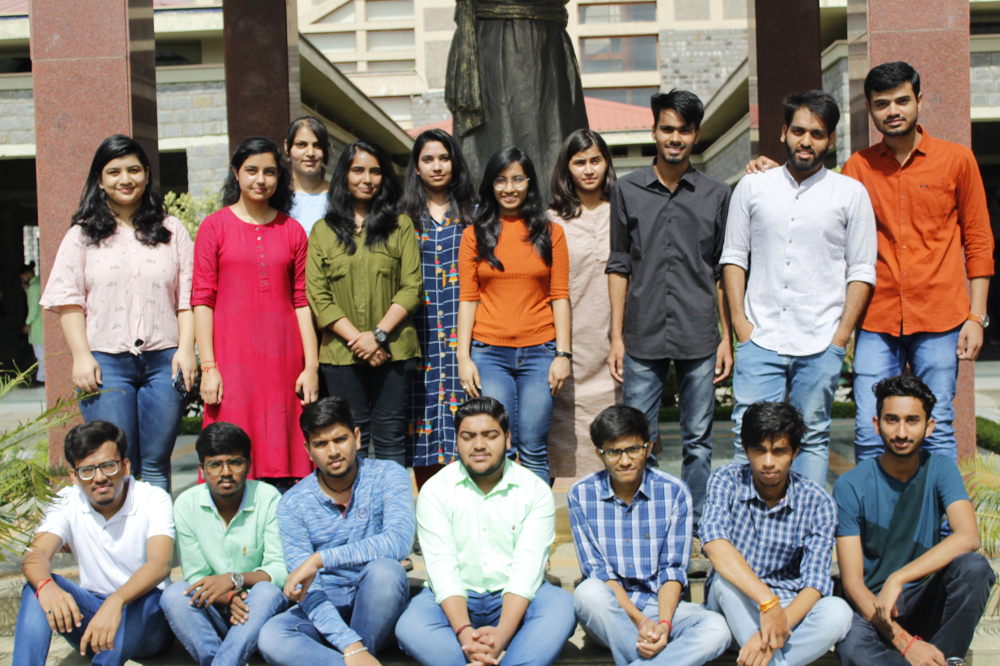

Every year, we Leos celebrate Independence Day and Republic Day by honouring the security guards of our campus. It gives us immense joy to pay our respects to the ones who are always on their toes all the year round for our protection. It is indeed one of our most cherished and awaited events. This sends out a very positive message of respecting the guards among all the students of our university. Another important thing to mention here is that almost half of the security guards are retired army- men. We are blessed to have this opportunity of honouring those who once served our nation.

[row]

[/row]

[row]
[col]

[/col]
[col]

[/col]
[/row]

[row]
[col]

[/col]
[col]

[/col]
[/row]

