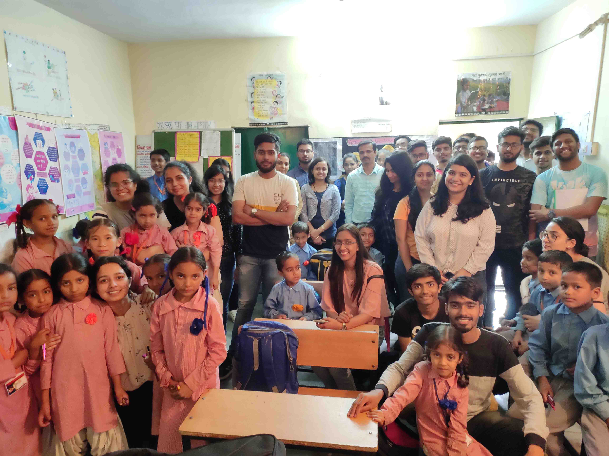
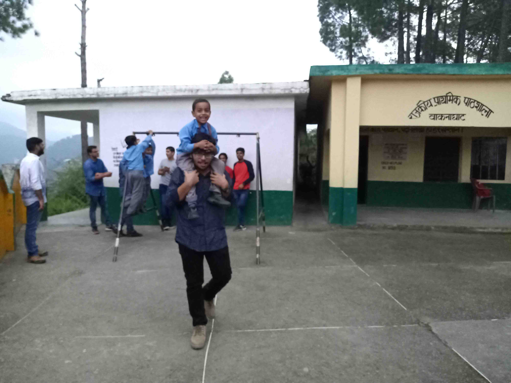

As a part of Omega Leo club, Waknaghat, we visit Waknaghat School regularly and interact with children of elementary classes.  

We play numerous games with them, interact with them ,teach them and provide them with things like stationery , chocolates and sweets. 

We strive to continue bringing them joy. It gives us immense pleasure to see their smiling faces and teaches us that the true sense of satisfaction and happiness lies in little gestures of giving and donating. 

We learn something new in our every visit and understand the needs, dreams and cherished hopes of the children that are often subdued in the environment that they live. 

We are determined to continue motivating them , to help them exploit their potential and to give them unconditional support and love.

[row]

[/row]

[row]
[col]

[/col]
[col]

[/col]
[/row]

    

            <video width="100%" height="400vw" controls>
                <source src="w1.mp4" type="video/mp4">
            </video>
    

    

            <video width="100%" height="400vw" controls>
                <source src="w2.mp4" type="video/mp4">
            </video>
    

[row]
[col]

[/col]
[col]

[/col]
[/row]
